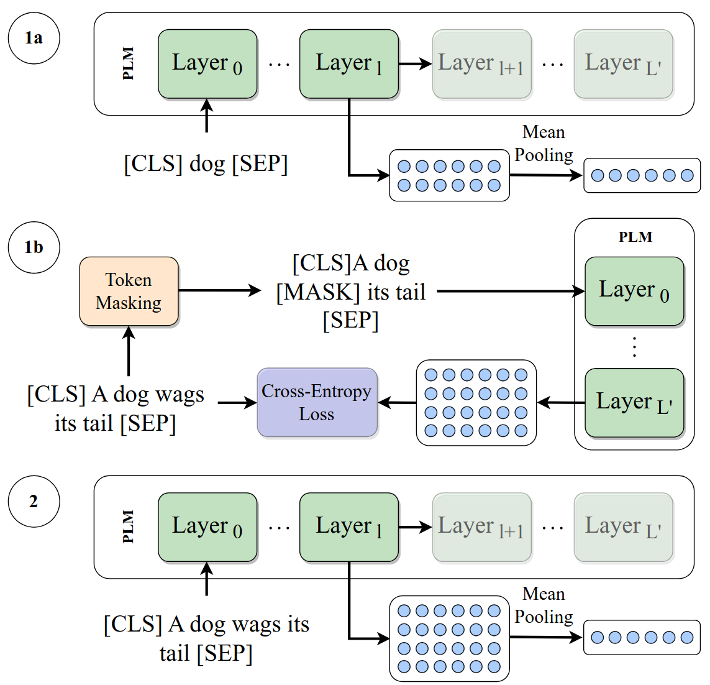
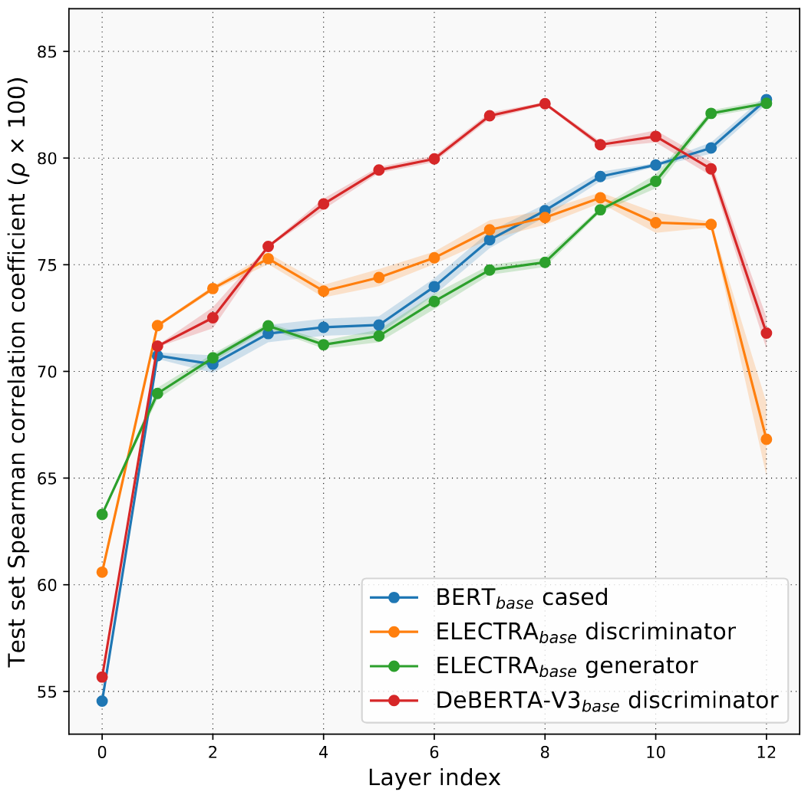
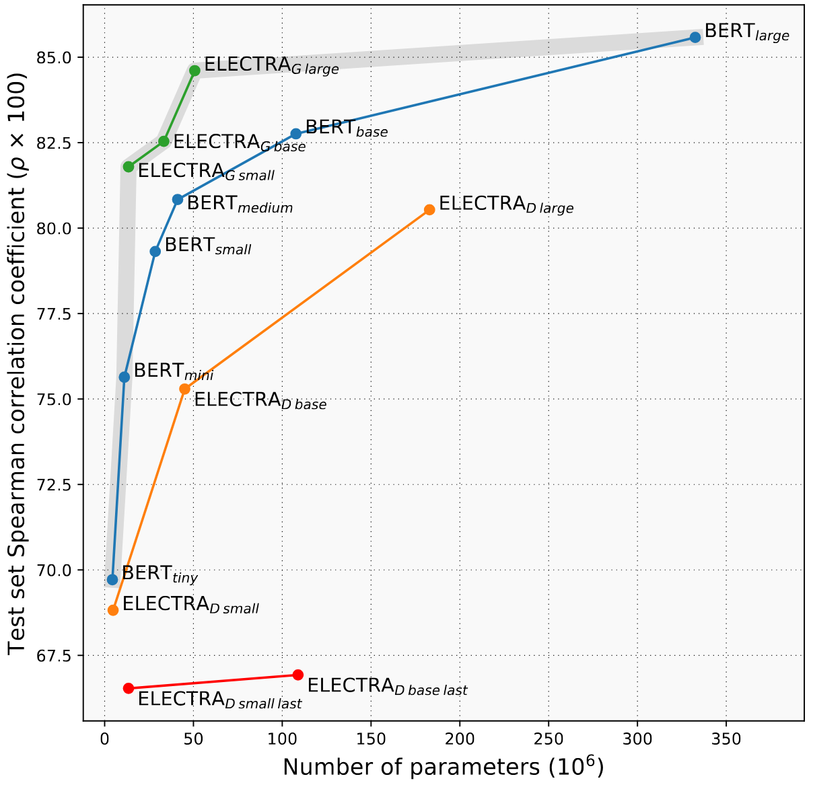

<h1 align="center">
    Are ELECTRA's Sentence Embeddings Beyond Repair? The Case of Semantic Textual Similarity
</h1>
<p align="center">
    
</p>

Code for the paper [Are ELECTRA's Sentence Embeddings Beyond Repair? The Case of Semantic Textual Similarity](https://arxiv.org/abs/2402.13130) accepted at EMNLP 2024 Findings.

# Overview

The general idea of the paper reduces to the following: 
- Final layers of models pre-trained using a replaced token detection are too specialized for the pre-training task

Our solution to this issue is truncating the model and then fine-tuning. Here's a minimal (inefficient) example:
```python
def mean_pooling(token_embeddings, attention_mask):
    input_mask_expanded = attention_mask.unsqueeze(-1).expand(token_embeddings.size()).float()
    numerator = torch.sum(token_embeddings * input_mask_expanded, 1)
    denominator = torch.clamp(input_mask_expanded.sum(1), min=1e-9)  
    return numerator / denominator


class TruncatedModel(nn.Module):

    def __init__(self, model_name, final_layer_idx):
        super().__init__()
        self.model = AutoModel.from_pretrained(model_name)
        self.final_layer_idx = final_layer_idx

    def forward_once(self, text):
        out = self.model(**text, output_hidden_states=True).hidden_states[self.final_layer_idx]
        pooled_out = mean_pooling(out, text["attention_mask"])
        return pooled_out

    def forward(self, texts):
        first_embedding = self.forward_once(texts[0])
        if len(texts) == 1:
            return first_embedding
        
        second_embedding = self.forward_once(texts[1])
        return first_embedding, second_embedding
```

Or a bit more optimized:
```python
class EfficientTruncatedModel(nn.Module):

    def __init__(self, model_name, final_layer_idx):
        super().__init__()
        self.model = AutoModel.from_pretrained(model_name)
        self.final_layer_idx = final_layer_idx

    def forward_once(self, text):
        out = (self.model.embeddings(text["input_ids"]),)
        k = 0
        while k < self.final_layer_idx:
            out = self.model.encoder.layer[k](out[0])
            k += 1
        out = out[0]
        pooled_out = mean_pooling(out, text["attention_mask"])
        return pooled_out

    def forward(self, texts):
        first_embedding = self.forward_once(texts[0])
        if len(texts) == 1:
            return first_embedding
        
        second_embedding = self.forward_once(texts[1])
        return first_embedding, second_embedding
```

A schematic overview of our methods can be seen below.

<p align="center">
    
</p>


Our proposed method reduces the number of parameters and **drastically** improves performance for discriminator models on the test set of STSB:
<p align="center">
    
</p>

Similar findings hold for different languages, and for other tasks (although not to the same extent).

Our other important finding is the often overlooked generator model. It achieves results comparable to BERT while being much smaller, and having a third of BERT's embedding size.

<p align="center">
    
</p>


# Usage

```
git clone git@github.com:ir2718/similarity-embedding-quality.git
cd similarity-embedding-quality

python3 -m venv similarity_venv
source similarity_venv/bin/activate
pip3 install -r requirements.txt
```

# Reproducing Results

To reproduce the paper results, scripts are provided in the `scripts` folder:

```
chmod +x scripts/get_data.sh
chmod +x scripts/run_dapt.sh
chmod +x scripts/run_mrpc_experiments.sh
chmod +x scripts/run_random_stsb_experiments.sh
chmod +x scripts/run_sick_multiclass_experiments.sh
chmod +x scripts/run_stsb_experiments.sh
chmod +x scripts/run_stsb_improvements.sh
chmod +x scripts/run_translated_stsb_experiments.sh
chmod +x scripts/run_wordsim.sh
```

Get the word similarity data and the Korean dataset:
```
./scripts/get_data.sh
```

## STSB Various sizes
For reproducing the results on STSB for various model sizes:
```
./scripts/run_stsb_experiments.sh
```

## STSB With Improvements
For reproducing the results on STSB with improvements:
```
python3 src/scripts/preprocess_word_sim_data.py
./scripts/run_dapt.sh
./scripts/run_wordsim.sh
./scripts/run_stsb_improvements.sh
```

## Translated STSB
For reproducing the results in Korean, German, and Spanish:
```
./scripts/run_translated_stsb_experiments.sh
```

## MRPC
For reproducing the results on MRPC:
```
./scripts/run_mrpc_experiments.sh
```

## SICK
For reproducing the results on SICK:
```
./scripts/run_sick_multiclass_experiments.sh
```